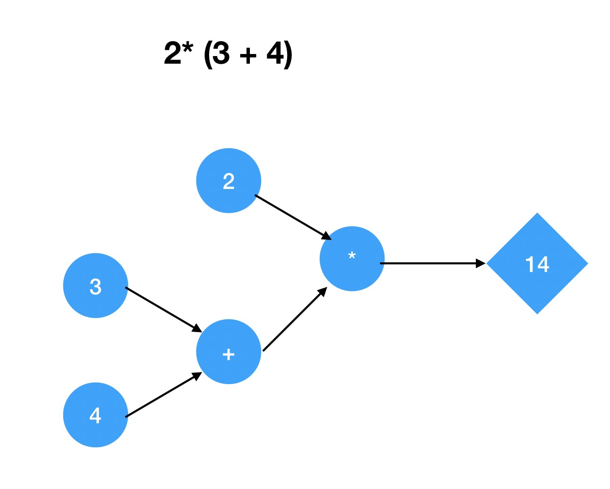

# 一个数学表达式的计算

## 表达式建模
如果有人问你 `2 * (3 + 4)` 等于多少，也许你会脱口而出说等于`14`， 但是你有没有想过，计算机是如何计算这个表达式的？为什么当你在计算机里输入`2 * (3 + 4)`， 它也能得出`14`？在思考计算机如何计算这个数学表达式之前，我们来看下人是怎么计算出结果的。`2 * (3 + 4)`本身是一串数学符号，当人看见这个表达式的时候，人脑需要解析这串数学符号，然后把这串符号转换成人能理解的模型，最后对这些模型根据从学校学的一些规则进行计算从而得出结果。为了更形象的了解这个过程可以先看看下面这张图：



当数学符号进入大脑后，`2 * (3 + 4)` 被解析成左右两部分：`2` 与 `3 + 4`以及一个乘法操作，这里的括号定义了计算的优先级，于是括号里的`3 + 4` 被解析成由一个值为`3`的模型和值为`4`的模型以及一个加号操作`+`。建模完成后便根据一定的规则进行计算，而这里的规则，可能就是课堂上老师教给你的方法。而`3 + 4`的结果又被送入下一步的操作，与另一个值模型`2`进行一次乘法操作，最终得出结果`14`。这时候，人就是一个计算机，而`2 * (3 + 4)`便是输入，在经过了解析，建模，对模型进行操作的过程后，得到输出。

## 什么是计算
在上面的例子中，一个数学表达式在**碳基**计算机中解析，建模并得出结论。相类似的，一台**硅基**计算机读取，运行程序，然后读去数据，最后输出一些数据。计算机是经过了某些`计算`才能得出一些结论然后输出数据的。所以也可以理解为计算机做的一些事就是计算。

## 程序
程序就是告诉计算机该做什么或者怎么做的一堆指令。程序员所编写的代码，本质上和上面所说的数学表达式一样，是一堆符号，它需要被计算机解释成计算机能理解的语言才能让计算机按照你的意愿行动。
### 语法
程序虽然只是一串长长的符号(字符串)，但是却是有一套自己的规则来描述哪些字符串是有效的，而这些规则，就是计算机语言的语法。比如`2 * (3 + 4)` 中， `2`, `*`, `+` 等等这些符号是有效的，能被识别的。

### 语义
语法只是程序表面上是长什么样的，却不知道其含义。如果要知道含义，就需要有一种机器(譬如上述例子中的人)， 能去解释程序是如何执行的。而机器本身需要理解一套自己的语言，去这套语言去定义程序里的规则，笔者这里使用`typescript`作为机器本身就理解的语言。

## 设计一种超级简单的计算机语言
有了刚刚对程序及计算的初步了解，我们就来设计一种超级简单的语言来计算`2 * (3 + 4)`这个数学表达式，我们可以把整个过程分为三步：
- 输入表达式`2 * (3 + 4)`
- 将表达式进行建模
- 将模型在机器上运行

为了更方便理解，我们先借助人脑对表达式进行建模。我们来定义一个**值模型**。这个值是一个不可以再归并的东西，我们设置`reducible`为`false`来说明它是不可以继续归并。
```ts
class Value {
  readonly reducible: boolean = false;
  value: number;
  constructor(value: number) {
    this.value = value;
  }
}
```
接着再定义一个加法器，加法器的左右两边，连同加法操作，是一个可以继续归并的表达式，比如`3 + 4` 这个表达式可以归并为`7`。所以我们设置`reducible`为`true`来表示它可以进行归并。我们还需要定义一个`reduce`方法来对这个加法的左右两边进行归并求值。而加号的左右两边，也可能需要进行归并，所有如果一旦`reducible`为`true`，便需要进行归并。具体代码可以看下面：
```ts
class Add {
  readonly reducible: boolean = true;
  left: any;
  right: any;
  constructor(left: any, right: any) {
    this.left = left;
    this.right = right;
  }
  reduce() {
    let left = this.left;
    let right = this.right;
    if (left.reducible) {
      return new Add(left.reduce(), right);
    } else if (right.reducible) {
      return new Add(left, right.reduce());
    } else {
      return new Value(left.value + right.value);
    }
  }
}
```
然后定义一个乘法器， 乘法实现的逻辑与加法实现逻辑类似，设置`reducible`为`true`，并且需要实现`reduce`来进行归并。
```ts
class Multiply {
  readonly reducible: boolean = true;
  left: any;
  right: any;
  constructor(left: any, right: any) {
    this.left = left;
    this.right = right;
  }
  reduce() {
    let left = this.left;
    let right = this.right;
    if (left.reducible) {
      return new Multiply(left.reduce(), right);
    } else if (right.reducible) {
      return new Multiply(left, right.reduce())
    } else {
      return new Value(left.value * right.value);
    }
  }
}

```

通过定义值，加法，乘法的描述，我们可以将`2 * (3 + 4)`变成如下描述：
```ts
new Multiply(
  new Value(2),
  new Add(
    new Value(3),
    new Value(4)
  )
)
```

最后定义个抽象的机器，这个机器需要能理解我们上面的模型描述。其实只需要不断的调用模型的`reduce`方法直到得到最终的值即可。
```ts
class Machine {
  expression: any;
  constructor(expression: any) {
    this.expression = expression;
  }
  run() {
    while (this.expression.reducible) {
      this.expression = this.expression.reduce();
    }
    console.log(this.expression);
  }
}
```

运行
```ts
new Machine(
  new Multiply(
    new Value(2),
    new Add(
      new Value(3),
      new Value(4)
    )
  )
).run();
```
最终得到
```ts
Value { reducible: false, value: 14 }
```
是不是超级简单？


