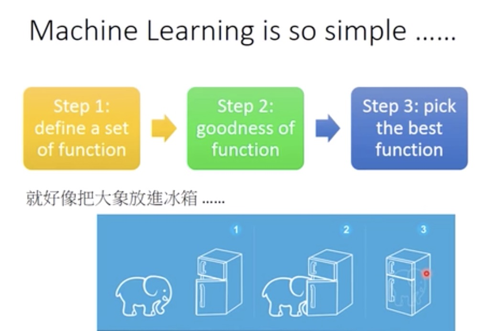
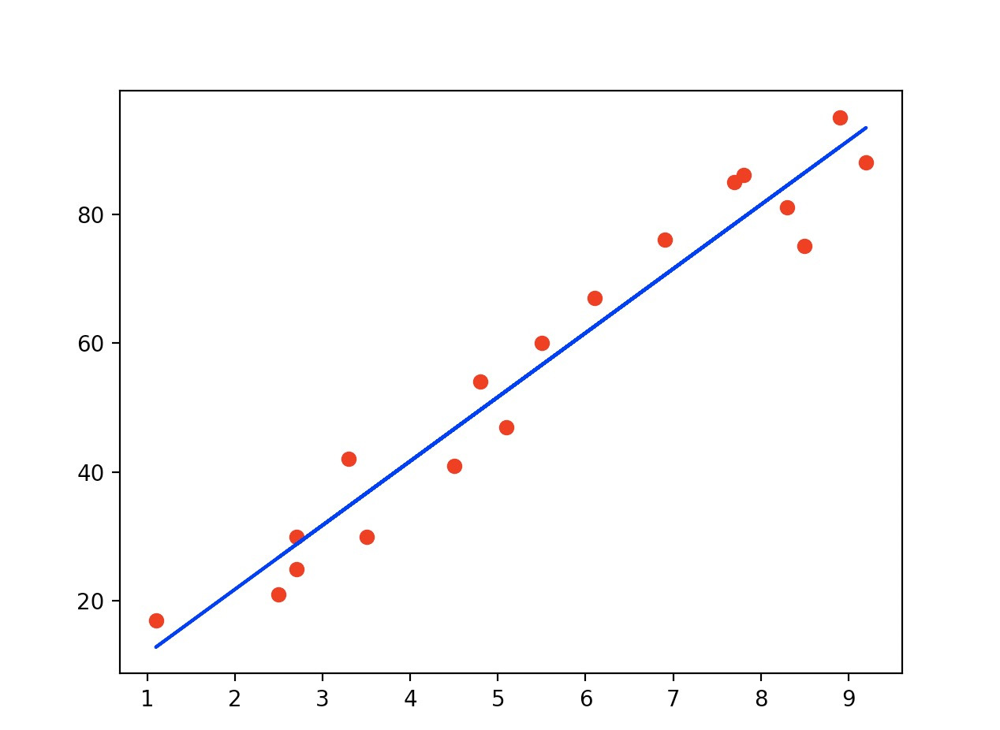

# 一个外行眼里的人工智能
最近几个月接触了一个语音识别的项目，虽然只是调一调`Machine Learning`的接口，但也逐渐体会到`AI`对于普通开发者来说越来越近，接入成本也越来越低。上周末刚好在亚马逊上看到一个叫`深度学习`的书，讲述了机器学习的发展史，看了下样章，便一发不可收拾的买下来，洋洋洒洒三十万字，从上世纪五十年代机器学习开始萌芽说的未来的深度智能一气呵成，俨然是一部气势恢宏的科技演进史。

在美剧`西部世界`里，描述了一个机器人意识觉醒的故事。在一个巨型高科技成人乐园里，机器人被设计出来，供玩家玩乐愚弄以满足其杀戮与性欲。他们被植入被编辑好的记忆，设定了某种角色，可能是妓女，可能是农场主，但都是为玩家娱乐而生。

直到机器人开始觉醒，意识到自己生活在一个供玩家游戏的乐园里，便开始反抗人类，开始了对人类的屠杀。

最后几个机器人逃出了`乐园`，潜藏在人类社会中生存下去，谁也不知道以后会发生什么。

## 机器学习
近些年，无人驾驶，语言识别，自然语言翻译等概念频繁出现在媒体上，那到底什么是人工智能`(Artificial Intelligence)`呢？正如字面的意思，它是一种人类创作的具有能以人类智能相似方式作出反应的机器。也就是说能人工智能可以像人类那样进行思考并作出反应。而机器学习便是开发出人工智能的一种手段。

机器学习就是这么简单(手动微笑脸😊)。 选择一个模型集合，使用数据进行拟合，然后挑选最好的`function`。so easy(再次微笑😊)， 就像把大象放到冰箱一样，只需要三步。然而，其中及其复杂的细节，却会让人抓狂。

### 场景分类
机器学习根据不同的场景可以分为很多个不同的类型，常见的有
  - Supervised Learning
  - Unsupervised Learning
  - Reinforcement Learning
  - ...
#### Supervised Learning
`Supervised Learning`说的是在给模型的数据里是包含期望的结果（Lables)。 就像有一个老师在那，你看见一张图片，老师会告诉你这张图片是猫的图片。在`Supervised Learing`里常见的模型是`Regression`和`Classification`这两类问题。`Regression`描述的是根据一组数据集(x, y)， 来预测一个新的`x`对应的`y`。比如说年龄和薪资的关系，当年龄为20时，薪资为2000每月，当年龄为21时，薪资为3000每月，那么当年龄为30时，薪资是多少？这就是一个`Regression`。`Classification`描述的是一个分类的问题，比如根据你是否有喉结，分为你是男生还是女生。如下是笔者用`python`画的线性回归。描述了学生学习成绩和分数直接的关系

#### Unsupervised Learning
`Unsupervised Learning`就更厉害了，在这个场景里，给模型的数据是没有被标记的，比如给计算机一堆图片，但是没有告诉计算机哪张图片是猫，哪张图片是狗，但是需要计算机去识别出来。

## 应用
AI将会逐渐的应用到生活的各个地方， **无人驾驶**会逐渐走入人们的生活。`Uber`已经在匹兹堡投放了一批自动驾驶机车。百度开发阿波罗平台，并且与汽车公司合作生产无人驾驶机车。可以料想到未来一辆自动驾驶的汽车可以在一分钟内出现在你旁边。超速和罚单不再存在。汽车可以停在城市的外围，城市内的停车场可以变成公园。**语言识别**和**自然语言翻译**让各种文化之间的交流不再有屏障，2016年微软开发的拥有120层的深度学习网络已经在多人语音识别基准测试中达到了与人类相当的水平。`AI医疗`将利用大数据为患者提供更精确的医疗诊断。人工智能在逐渐改变人类的社会。未来将来，让我们拭目以待吧。
