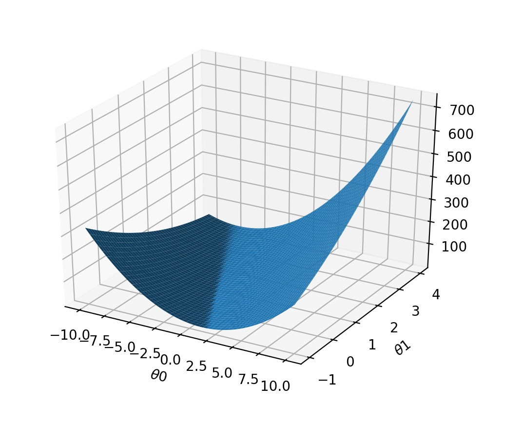

## 你刻意练习了么？
在`刻意练习`这本书里，作者用大量的数据和例子来阐述这么一个观点：任何人利用正确的方法进行刻苦的练习，都可以在某个领域做到卓越。其中一个例子就是对小提琴学生做的调研。他把学生分为三组(即优秀，优异和最杰出三个小组)，他发现他们之间最重要的差别是练习的时长，天生的天赋虽然刻意在刚开始能让人学习的更快，但是从长期来说，并没有起到决定性的作用。在18岁之前，优秀的学生平均训练时长是3420小时，优异的学生是5301小时，而最杰出的学生练习时长达到了7401小时。作者以此来证明任何人经过刻苦练习便可以达到杰出的水平。

## 线性回归
那么我们假设`刻意练习`里的结论是正确的，我们假设有一组练习时长与数学成绩的数据。
练习时长(h/w)|成绩
--|:--:|--:
2.5 | 69
3| 70
3.5|76
4 | 80
4.5|88
5| 90
5.5|94

那我们该如何去寻找练习时长与成绩之间的关系呢？如果找到了这个关系，在知道一个学生的练习时长的情况下，便可以预测出他的成绩。我们来假定练习时长与成绩是一个线性的关系，那么一个假设的关系函数可以用如下式子表示:
$$
h(\theta) = \theta_0 + \theta_1 * X_1
$$

如果样本的数量为`m`, 那么我们可以求得相对于这个关系的方差
$$
Variance(\theta) = \sum_{i=1}^m(h(\theta)(x^i) - y^i)^2
$$

取其平均值，则可以表示为
$$
J(\theta) = 1/2m * \sum_{i=1}^m(h(\theta)(x^i) - y^i)^2
$$

$J(\theta)$ 越小，说明我们的预测将会越准确。所以问题求解转换成了求使得$J(\theta)$最小的$\theta$值，即
$$
minJ(\theta)
$$

我们可以随便给定一个$\theta$值，然后在逐步缩小范围，当$\theta$值稳定在一个数值的时候，说明找到了一个值是可以另$J(\theta)$最小的。逐步缩小范围的步骤可以用如下操作:
$$
\theta_j = \theta_j - a * \frac{\partial}{\partial \theta_j}J(\theta)
$$

通过这个方法得出了$\theta$值后，便确定了刚开始定义的$h(\theta)$， 利用这个函数便可以预测出练习时长和成绩之间的关系。而这种方法便是机器学习中的线性回归。而求解$\theta$的过程便是梯度下降算法。

求出$\theta$后，便可以将$\theta$代入$h(\theta) = \theta_0 + \theta_1 * X_1$从而得到成绩和练习时长的关系。

## 线性回归Python实现
首先我们来实现$J(\theta)$， 笔者使用`Numpy`做数值计算的库，使用`matplotlib`做数据的可视化。

### 代价函数
根据上面提到的
$$
J(\theta) = 1/2m * \sum_{i=1}^m(h(\theta)(x^i) - y^i)^2
$$
我们来定义`compute_cost`函数，只需要按照公式转化为矩阵运算即可。
```python
def compute_cost(X, y, theta):
    m = y.size
    prediction = X.dot(theta) - y
    sqr = np.power(prediction, 2)
    cost = (1 / (2 * m)) * np.sum(sqr)
    return cost
```

我们可以将代价函数与`theta`的关系可视化出来:
```python
def plot_J_history(X, y):
    theta0_vals = np.linspace(-10, 10, 100)
    theta1_vals = np.linspace(-1, 4, 100)

    J_vals = np.zeros((theta0_vals.size, theta1_vals.size))

    for i in range(theta0_vals.size):
        for j in range(theta1_vals.size):
            theta = np.array([theta0_vals[i], theta1_vals[j]])
            t = compute_cost(X, y, theta)
            J_vals[i, j] = t

    theta_x, theta_y = np.meshgrid(theta0_vals, theta1_vals)

    fig = plt.figure()
    ax = fig.gca(projection='3d')
    ax.plot_surface(theta_x, theta_y, J_vals)

    ax.set_xlabel(r'$\theta$0')
    ax.set_ylabel(r'$\theta$1')
    plt.show()

plotData.plot_J_history(X, y)
```
得出的图像大概是:


而这个图像最低的点，就是需要通过递归下降算法求出的点。

### 递归下降
上述的递归下降的微分表达式可以转化为数值表达式

$$
\theta_j = \theta_j - a * (1 / m) * \sum_{i=1}^m(h(\theta)(x^i) - y^i)x_{j}^{i}
$$

用`python`则可以表示为:
```python
def gradient_descent(X, y, theta, alpha, num_iters):
    m = y.size
    J_history = np.zeros((num_iters))

    for i in range(0, num_iters):
        prediction = X.dot(theta) - y
        delta = prediction.dot(X)
        theta = theta - alpha * (1 / m) * delta
        J_history[i] = compute_cost(X, y, theta)

    return theta, J_history
```
我们可以调用该函数求解$\theta$
```python
theta = np.zeros((2,))
iterations = 1500
alpha = 0.01

theta, J_history = gradient_descent(X, y, theta, alpha, iterations)
```
求出$\theta$后代入$h(\theta)$就可以得出成绩与练习时长的关系。

### 最后
其实，看起来很麻烦，但是利用`sklearn`分装好的算法，只需要几行就可以搞定线性回归
```python
from sklearn.linear_model import LinearRegression
... 导入训练数据
regressor = LinearRegression()
regressor = regressor.fit(X_train, Y_train)
```
这样就好了，so easy...
