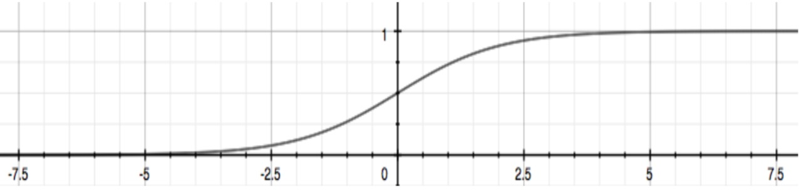
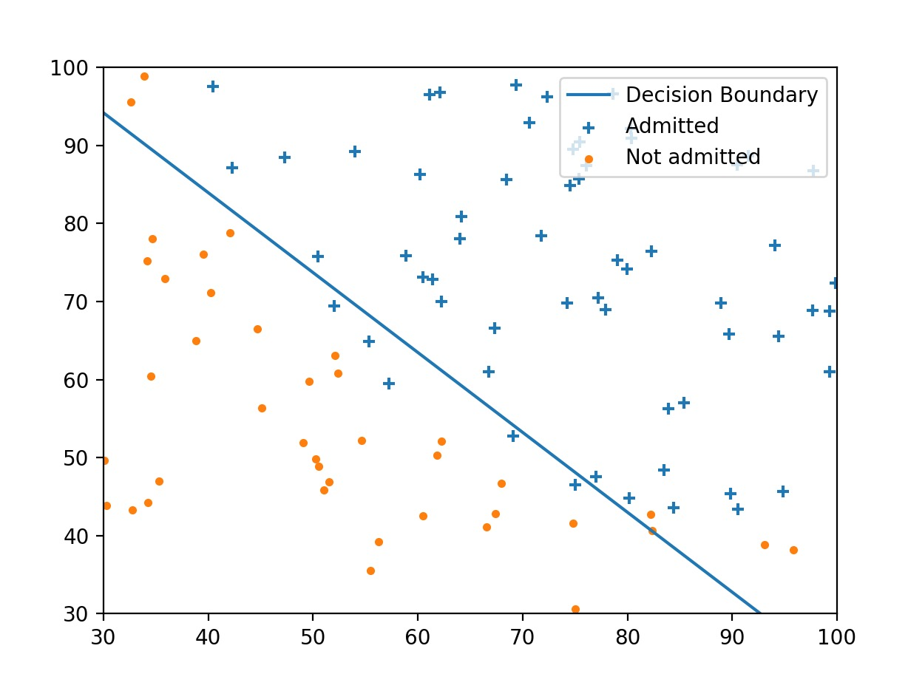

## 逻辑回归 —— Yes Or No
逻辑回归解决的便是一个分类的问题。就是需要一段代码回答YES或者NO。 比如辣鸡邮件的分类，当一封邮件过来，需要识别这封邮件是否是垃圾邮件。

### 一个简单的例子
笔者借用`Andrew Ng`给的学生成绩与申请大学的例子来讲述`Logistic Regression`算法实现。假设你有学生的两门课的历史成绩与是否被录取的记录，需要你预测一批新的学生是否会被大学录取。其中部分数据如下:
exam1|exam2|录取(0:failed; 1: passed)
--|:--:|:--:|--:
34.62365962451697|78.0246928153624|0
30.28671076822607|43.89499752400101|0
35.84740876993872|72.90219802708364|0
60.18259938620976|86.30855209546826|1
79.0327360507101|75.3443764369103|1
45.08327747668339|56.3163717815305|0
61.10666453684766|96.51142588489624|1

这里`exam1`和`exam2`的分数作为模型的输入，即`X`。 是否被录取则是模型的输出， 即`Y`, 其中 $Y\in{1, 0}$

#### 假设函数
我们定义个假设函数 $h_{\theta}(x)$, 通过这个函数来预测是否会被录取的概率。所以我们希望$h_{\theta}(x)$的取值范围是[0, 1]。`sigmoid`函数是一个匹配度很高的函数。如下是`sigmoid`函数的图像:


我们利用`python`来实现这个函数:
```python
import numpy as np

def sigmoid(z):
    g = np.zeros(z.size)
    g = 1 / (1 + np.exp(-z))
    return g
```
我们假设$g(\theta)$的定义为：

$$
g(\theta) = \theta_0 + \theta_1 * X_1 + \theta_2 * X_2 = \theta^TX
$$

我们可以令$h_{\theta}(x)$的定义为：
$$
h_{\theta}(x) = h_{\theta}(g(\theta)) = 1 / (1 + e^{-\theta^TX})
$$

#### 代价函数$J(\theta)$

给出了$h(\theta)$的定义以后，我们就可以定义$J(\theta)$了

$$
J(\theta) = 1 / m \sum_{i=1}^mCost(h_{\theta}(x^i), y^i)
$$

为了在进行梯度下降时找到全局的最优解，$J(\theta)$的函数必须是一个凸函数。所以我们可以对`Cost`进行如下定义:
$$
Cost(h_{\theta}(x), y) = -log(h_{\theta}(x)) if y = 1
$$

$$
Cost(h_{\theta}(x), y) = -log(1 - h_{\theta}(x)) if y = 0
$$

最后求出梯度下降算法所需要使用的微分即可：
$$
\frac{\partial}{\partial \theta_j}J(\theta) = 1 / m * \sum_{i=1}^m(h_{\theta}(x^{i}) - y^{i}) * x_{j}^{i}
$$

利用`python`的实现如下：
```python
import numpy as np
from sigmoid import *


def cost_function(theta, X, y):
    m = y.size
    cost = 0
    grad = np.zeros(theta.shape)

    item1 = -y * np.log(sigmoid(X.dot(theta)))
    item2 = (1 - y) * np.log(1 - sigmoid(X.dot(theta)))

    cost = (1 / m) * np.sum(item1 - item2)

    grad = (1 / m) * ((sigmoid(X.dot(theta)) - y).dot(X))

    return cost, grad
```

我们使用`scipy`来对该算法的求解做一定程度的优化:
```python
import scipy.optimize as opt
def cost_func(t):
    return cost_function(t, X, y)[0]


def grad_func(t):
    return cost_function(t, X, y)[1]


theta, cost, *unused = opt.fmin_bfgs(f=cost_func, fprime=grad_func,
                                     x0=initial_theta, maxiter=400, full_output=True, disp=False)
```

通过这个方法，可以求出在模型中所需要使用的$\theta$。从而将该模型训练好。

#### 可视化
为了方便观察数据之间的规律，我们可以将数据进行可视化出来
```python

def plot_data(X, y):
    x1 = X[y == 1]
    x2 = X[y == 0]

    plt.scatter(x1[:, 0], x1[:, 1], marker='+', label='admitted')
    plt.scatter(x2[:, 0], x2[:, 1], marker='.', label='Not admitted')
    plt.legend()

def plot_decision_boundary(theta, X, y):
    plot_data(X[:, 1:3], y)

    # Only need two points to define a line, so choose two endpoints
    plot_x = np.array([np.min(X[:, 1]) - 2, np.max(X[:, 1]) + 2])

    # Calculate the decision boundary line
    plot_y = (-1/theta[2]) * (theta[1]*plot_x + theta[0])

    plt.plot(plot_x, plot_y)

    plt.legend(['Decision Boundary', 'Admitted', 'Not admitted'], loc=1)
    plt.axis([30, 100, 30, 100])
    plt.show()
```
效果是这样的:


#### 预测
当求出了$\theta$之后我们当然可以利用这个来进行预测了，于是可以编写`predict`函数
```python
import numpy as np
from sigmoid import *


def predict(theta, X):
    m = X.shape[0]
    p = np.zeros(m)

    prob = sigmoid(X.dot(theta))
    p = prob > 0.5
    return p
```
对于`X`中的数据，当概率大于`0.5`时，我们预测为能通过大学申请。
