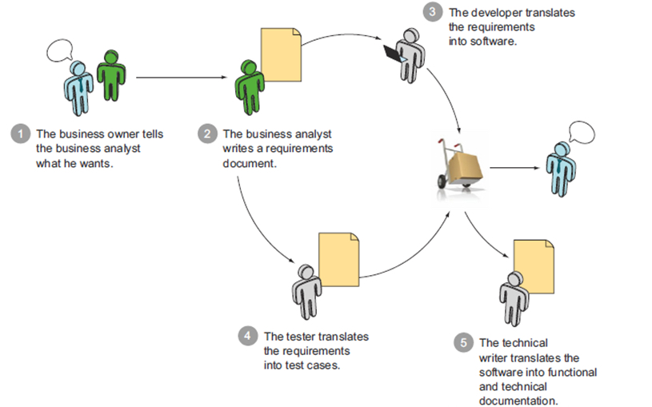
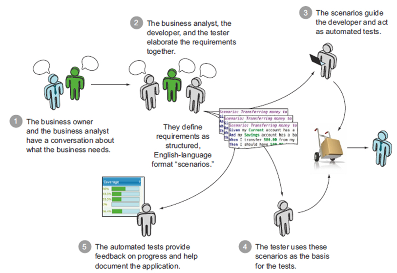

# 工程师团队中的信息流动
## 什么是信息
在讨论信息在团队中流动之前，首先让我们想想什么是信息。
> 信息既不是物质，也不是能量，信息就是信息

这是著名的控制论创始人维纳给**信息**下的定义。他把信息和物质与能量放到了同一个层次来讨论，足以体现**信息**的重要性。

信息论的创始人香农从信息的功能和用途的角度来讨论信息，他认为: **信息就是能够消除不确定性的东西**。 也就是说，信息意味着秩序，它将事物联系在了一起，并按照一定的秩序组织到在了一起。我们之所以能相互合作就是通过交换信息来进行，我们之所以能开发出一套软件，就是在有了足够的信息后才能开发。信息消除了软件开发过程中的不确定性。

## 信息的传播
那信息又是如何从一方传播到另一方的呢？一条信息的传播包含如下五个方面：
- 信源发布信息
- 信息发布形式
- 信息载体
- 对信息的解读
- 接收方

比如小明在纸上画了一朵小红花送个了小歆，这里小明便是一个信源，小歆是接收方，信息的发布形式是小红花图案，载体就是纸墨，小歆会从纸上的小红花里解读出各种神奇的意思，这就是一个完整的信息传播链。在这个信息的传播过程中，信息是不可能做到无损传播的，也就是说小歆不可能从信息中一丝不差地解读出小明想要表达的意思。但是制定适当的策略可以提高信息的传递效率，降低信息在传输的过程中丢失率。

## 信息传播效率
在一个工程师团队中，信息源、信息的接收方基本已经确定没法改变，如果需要提高信息的传输效率，那么便需要制定合适的信息发布形式和信息的解读方式，并且需要选择合适的信息载体。

### 传统开发模型里的信息传递
说到传统开发模型，大伙儿第一反应便是`瀑布模型`, 但是瀑布模型是有许多变种。今天来介绍一种叫做`小瀑布模型`, 就是在经典的`瀑布模型`上引入迭代的概念，每一个迭代就是一个`瀑布`，那每个迭代里的软件活动可以用下图来描述

在这个模型中，软件活动主要分为如下五步：
1. 需求方告诉产品经理他们的需求
2. 产品经理根据需求编写需求文档
3. 开发人员根据需求文档编写软件
4. 测试人员根据需求文档编写测试用例
5. 编写技术手册

在这里，信息的流动基本是单向的： *需求方 -> 产品经理 -> 开发/测试*。开发人员和测试人员对需求的理解都是基于产品经理的需求文档。假设每次信息传播的损耗为`10%`, 那么开发人员和测试人员理解的信息只有需求方真正想传递信息的 `81%`， 而测试人员与开发人员对于同一份需求文档，又可能有`10%`的不一致。所以在软件活动中，需要一遍又一遍的进行沟通来矫正这些误差。

### 敏捷开发模型里的信息传递
在笔者看来，软件开发里，敏捷的一个重要的技术基础就是自动化，自动化程度越高，敏捷跑的就越顺利。那么在自动化程度高的团队里，信息是如何传递的呢？`BDD`(行为驱动开发)是敏捷团队中可能使用到的一种开发方式，我们可以先借用这个模型来分析下敏捷方法。

 这里主要分为五个步骤来组织流程：
 1. 需求方和产品经理一起讨论出软件功能的范围和需求
 2. 产品经理与开发者和测试人员一起定义好在不同场景下软件的行为和功能，并定义出一份叫`scenarios`的文件
 3. `scenarios`指导开发者进行开发
 4. `scenarios`指导测试人员对软件进行测试
 5. 利用自动化的测试来持续提供软件质量的反馈

在`BDD`形式的软件活动中，所有的活动都是围绕着第二步所形成的`scenarios`进行的，也就是说`scenarios`的定义是`BDD`区别于其他活动的一个重要因素。而自动化则是为整个活动提供持续的反馈。这这里, `scenarios`的形成需要产品经理，开发者，测试人员三个角色一起定义出来，而非是由产品经理一人定义，这样就有效地防止了需求与开发/测试脱节。 开发人员利用`scenarios`编写自动化测试，测试人员利用`scenarios`编写测试case, 这样就有效防止了开发人员与测试人员的脱节。在这个过程中，信息的来源便是共同定义的`scenarios`，很大程度上保证了各个角色对产品的需求理解是相同的， 依旧假定每次信息的传播损耗为`10%`, 那么开发人员和测试人员能理解`90%`的需求方的信息，而开发人员和测试人员之间基本没有理解上的误差(当然这只是很理想的情况)。而自动化则一次又一次的利用机器对人所开发出来的软件进行校验，防止了信息在之后传播过程中产生误差。

## 信息载体，文档还是语音？
既然在一个软件开发团队中，需要做的是降低信息传播的损耗，那该选择哪种载体进行信息传播？毫无疑问，语音即面对面交流能提供当前最新鲜的信息, 这里满足了信息的实时性。然而，语音交流的效率却让人不敢恭维。假设说话的语速为 `500ms` 每个字，那么一个小时只能说`7200`个字， 其中很多语句是无效的，假设有效率是`70%`， 那么只有`5040`个字是包含了有效的信息。而如果是文字，假设阅读速度是`200ms`每个字，那么每个小时能看`18000`个字，当然这是以牺牲掉信息的实时性作为代价。文档与实时的语言都有其价值，因为软件开发过程中，及时的理解变化很重要，这里需要靠低成本的实时语言，沉淀也很重要，这里需要有经过思考后形成的文档。而难的地方，大概是如何在两者中找到平衡吧。
