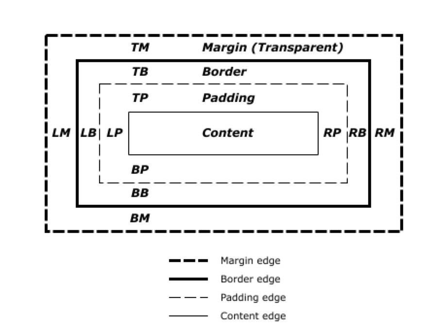

# 视觉格式化模型
视觉格式模型描述的是浏览器如何将`Dom Tree`可视化的渲染出来， 在视觉格式化模型中，每个元素都会生成`0~N` 个盒子，这些盒子通过一定的规则进行排列及尺寸计算。

## 盒子模型（Box Model）
既然每个元素都可能会生成盒子，那么先来了解一下什么是盒子。在`css`中，盒模型描述的是在DOM树中的元素生成的一个长方形的盒子，并且会根据一定的规则布局在浏览器的页面中。
<br/>
每一个盒子都包括内容区(content)、填充区(padding)、边框(border)、页边空白(margin)



所以整个盒子的尺寸计算是：`content + padding + border + margin`
这些组成部分决定了盒子的尺寸计算， 在标准的尺寸计算模型中，`content`的大小是由被渲染的元素决定的，很多因素会决定元素内容渲染的尺寸，比如这个元素的`width`和`height`属性、元素包含的其他盒子等。
<br/>
但是在怪异模式下，`width`和`height`是等于`content + padding + border + margin`, 有时候为了方便布局，可以利用利用如下方式切换标准模式到该模式下：
```css
box-sizing: border-box
```

## 文档流 (Normal Flow)
文档流就是浏览器默认的盒子(Box)排布方式，一般是从左到右，从上到下。文档流是相对于盒模型来讲的。对于行内的元素，它们会水平排列，直到一行被占满；而对于块级元素则会被渲染成独立的一行。盒子在文档流中可以属于两者不同的格式化上下文
  - 块级盒子拥有块级格式化上下文(block formatting context)
  - 行内盒子拥有行内格式化上下文(inline formatting context)

一个盒子不能同时拥有以上两种格式化上下文
<br/>
### 块级格式化上下文(block formatting context)
块级格式化上下文简称为`BFC`, 在`BFC`中的元素可以看做拥有一个独立的渲染容器，容器里的元素不会影响到容器外面的元素。触发一个元素的`BFC`可以通过以下几个方式：
  - 浮动
  - 绝对定位
  - 利用块级容器来包裹非块级盒子，比如设置`inline-blocks,table-cells,table-captions`
  - `overflow`为`非visible`的块级盒子

块级盒子的排列方式是垂直方向进行排列，两个盒子之间的垂直距离主要由`margin`属性决定。在正常流中的两个盒子，计算两个盒子的垂直距离时，`margin`会发生重叠。所以只需要让两个盒子处在不同的格式化上下文中，便可以避免这种情况的发生。比如触发其中一个盒子的`BFC`。
```scss
.bfc-wrapper {
  background-color: cadetblue;
  margin: 10px;
  overflow: hidden; // 触发BFC
  .element {
    background-color: aqua;
    margin: 10px;
  }
}
```
```html
  <div class="bfc-wrapper">
    <div class="element">hello BFC</div>
  </div>
```
这里 `DIV.bfc-wrapper`和`DIV.element`处在不同的格式化上下文中，于是`margin`便不会发生重叠。
`BFC`在实际开发中还是比较有用的，比如
  - 包裹浮动元素，防止父元素高度坍塌
  - 清除浮动

总之，`BFC`是一个在布局中比较常涉及到的一个概念。

### 参考资料
- https://www.w3.org/TR/CSS21/visuren.html#visual-model-intro
- https://www.w3.org/TR/CSS21/box.html
