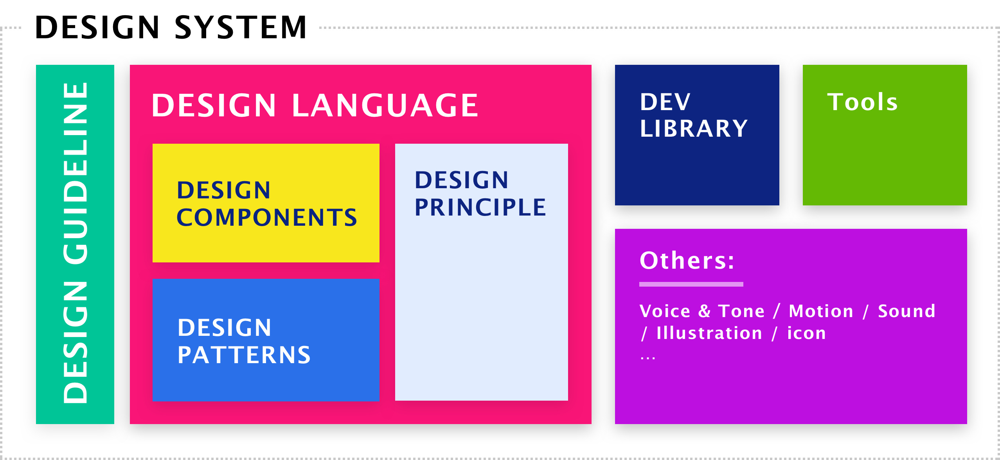

# Design System
## 简介
设计系统的产生是为了某领域内产品在不同平台和设备上都保持设计和交互风格的统一。既然是一个系统 ，那必须具有完整性，它提供了设计，内容等方面的指导。整个设计系统主要包含`Design Principle`, `Design Language`, `Code Library` 和一些相关的`Tools`组成。



## 主流风格
目前业界广泛使用的`visual language`包括`Material Design`, `Metro Design` 等等。可以想象有一个数轴，数轴一端是扁平，另一端是拟物。目前大部分的设计风格都分布在这数轴之间。
### Material Design
`Google`的`Material Design`是一个使用广泛的视觉语言(visual language). 统一了`google`系产品的视觉风格，并且能对其进行一定程度的客制化。
> Material Design is inspired by the physical world and its textures, including how they reflect light and cast shadows. Material surfaces reimagine the mediums of paper and ink.

与`Apple`的拟物化不同，`Material Design` 把风格从拟物往扁平化的方向拉了一拉，但却不是完全的扁平。它保持了物理世界的一些特质和纹理，并从`X轴`、`Y轴`、`Z轴` 三个维度描述一个物体. 在`Z轴`上的投影模拟了光的照射和基于此形成的阴影, 从而使设计元素有了立体的感觉。譬如`Button`的设计便是在底部利用`shadow`使按钮有略微上浮的感觉从而形成立体感。`Card`设计也是类似，利用`border`和`shadow`使整个`Card`从屏幕中上浮出来一般。

> Material is the metaphor

`Materail`是一种隐喻。纸张和油墨先于电子屏出现在人们的生活中。中国汉代发明了造纸术，纸张作为书写材料得以普及，北宋的活字印刷术把文字低成本的放到了纸上，纸张上的信息得以较为广泛的传播。如今大量的信息从物理世界的纸张转移到了电子屏幕上。`Materail Design` 借用了纸张的隐喻并从传统的印刷方案中得到启发，元素具有纹理、质感、阴影、折叠等纸张的特性并且拥有排版、颜色、字体上的规则。点击元素触发的水波纹犹如魔法棒施加魔法的过程，等待着水波纹褪去后的惊喜，这大概便是连接虚拟世界和现实世界的魔法。

## Design language
`Design language`较为重要的组成部分便是`Design Principle`, `Design Pattern`和`Design Components`这三部分。 `Design Principle`给出了高级别的抽象，是整个`Design language`的精神指导，就像某种文化一般，贯穿在设计与开发的所有环节。`Design Pattern`则是组合`Design Components`来解决现实中一类问题的规则。交互设计师和产品经理都可以利用这些规则来进行相应的交互和产品上的设计。
### Design Principle
`Design Principle`描述了某个领域内业务形态或者操作形态的一系列规则。它体现的是某种精神，你的产品设计，UX/UI设计等都需要围绕着这些`spirit`。不同的公司甚至不同的团队都会有不同的`Principle`，但是也可能具有相同的`Principle`。`google`提出的`Meteral Design`, 便许多公司都遵从着这套方案，但是也会根据自己的业务做一定的修改，从而形成自己独有的`spirit`。 例如某通讯公司的`Design Principle`是：
- High Efficiency（高效）
- Communicating Authentic（沟通真实）
- Build Trust（可信）
- Stay Stable（稳定）

在产品及UX设计过程中，都需要去遵循这些原则。一个行为交互是否能应用在产品上，首先要考虑是否符合这些原则。譬如一款通讯软件，右侧列表里是否需要对**单聊**与**群聊**分为两个不同的类别，对于服务于企业的通讯软件，或许需要对两个类别进行分类会更高效。这里的考虑便是是否遵守了`High Efficiency`。

### Design Pattern
`Design Pattern`是对某一类问题解决方案的抽象。用GUI程序开发的角度去看的话，它应该是对应于业务组件。既然是业务组件，那么就是针对了某一类具体业务的解决方案。一个具体的交互场景是用户利用表单来提交数据。用户的操作无非是：
- 输入数据
- 提交数据

但是用户在进行这两个步骤时，会出现数据校验，包含校验规则，校验失败和成功的提示, 提交数据前的确认对话框，提交数据后的反馈（成功或者失败提示）。这些共同构成了表单数据提交场景下的`Pattern`。简而言之，`Design Pattern`就是利用基础组件解决某一类问题的方案。

### Design Components
`Design Components`是一系列的基础原件。就从`web`领域来说，它可能是浏览器上的输入框，按钮，复选框，弹出框等一系列的不带有业务的基础组件。而对于一个组件来说，需要定义它在不同交互操作时的不同表现的规范。拿最常见的组件`Button`(按钮)来说，它在点击(active)， 鼠标移到它的上方(hover)， 禁用(disabled)时的具体表现，包括颜色变化，动画效果等都需要在`Design Components`里进行详细的定义，这样才能说一个`Design Component`是完整的和可用的。

## Code Library
`Code Libray`的基本组成便是`Components`。 理想状态下，代码中库`Components`是实现了`Design Language`中的大部分的`Design Components`和`Design Pattern`，当然在现实情况下会视情况而定。在开发基于某个`Design Language`的代码库时，需要针对该`Design Language`建立基本的`Foundation`, `Design token`， 最后才在此基础上开发相应的`Components`

### Foundation
在建立代码库时，首要的便是先要建立`Foundation`，这便需要与交互设计师进行反复沟通，确定基本的布局，颜色，字体字号等。一旦确定后，之后组件的开发都会利用`Foundation`里定义好的规范来进行。在代码实操中，`Foundation`主要会包含`Theme`和相应的辅助函数。

### Design token
`Design token`是设计尺度的固化，它描述了在这个设计系统中的颜色，字体，边框等一系列设计规格的所有可能取值。`Design token`与计算机语言里的枚举的概念有些类似，在用代码实现的一套组件的过程中，可以将`Design token` 分为名称和值两部分。名称一旦定下来，便不可改变，值则可以根据需要进行配置。譬如可以用如下代码描述一个字体的`Design token`
```js
// 定义名字
interface FontSize {
  small: string;
  medium: sting;
  large: string;
  xlarge: string;
}
// 定义值
const fontSize: FontSize = {
  small: '12px';
  medium: '14px';
  large: '16px';
  xlarge: '18px';
}
```
在上面的定义中，我们规定了在一个设计系统中字体大小的取值只有四种: `small`, `medium`, `large`, `xlarge`, 在用代码来实现的组件库中，字体的大小只能取这四个类型，每个类型对应于一个特定的值。值的可配置化是设计系统客制化的重要组成部分。得益于这些`token`的建立，各个角色对遵循于此设计系统的产品在设计上能达到一定程度的共识。

### Theme
`Theme`定义了一个设计系统的主题调，它包含所有的`Design token`以及一些相应的计算规则。譬如当鼠标悬浮至一个`button`上时，背景色会根据`button`原有的色值按照一定的规则进行计算。
```js
interface Palette {
  ...
  action: {
    hover: Function;
  }
}

const palette: Palette = {
  action: {
    // 将透明度变为0.8
    hover: (color) => color.setAlpha(0.8);
  }
}
```
这样便定义了一个`hover`的规则，当鼠标悬浮到一个`button`上时，`button`的色值的透明度便会变成`0.8`;

### Components
`Components`主要是组成一个界面的最基础元素以及相应的`Design Pattern`。在代码层面，需要关注的是高度的还原`Design Language`中定义的组件，以及需要符合软件开发的规范。譬如灵活性，鲁棒性等。就最常用的`Button`来说，如下是一种定义组件的方法:
```js
interface BtnProps {
  variant: 'round' | 'plain';
  size: 'small' | 'medium' | 'large';
  color: 'primiry' | 'secondary';
  loading?: boolean;
  children: any;
}

class Button extends Component <BtnProps> {
  .....
}

export default Button
```
这里主要定义了`Button`组件的`variant`,`size`,`color`,`loading`四种属性，在使用过程中，通过控制这四种属性来便可以控制组件的形态。

这便是一个`Design System`的主要组成部分。当然在实际开发过程中，可能会遇到很多跨角色沟通，跨team合作等沟通合作商的问题，也会遇到很多软件质量和设计上的问题，这些都是在构建一个`Design System`时需要解决的问题。
